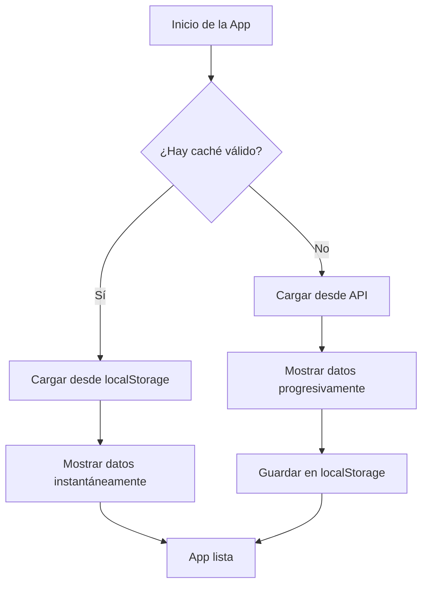

# Sistema de Caché - Watter App

## 📋 Descripción General

La aplicación Watter App ahora implementa un sistema de caché inteligente que mejora significativamente el rendimiento y la experiencia del usuario. El sistema utiliza **localStorage** para persistir los datos entre sesiones de la aplicación.

## 🚀 Características del Sistema de Caché

### 1. **Caché Persistente**

- Los datos se guardan en `localStorage` del navegador
- Persistencia entre sesiones de la aplicación
- Duración configurable (por defecto: 24 horas)
- Versionado para compatibilidad futura

### 2. **Carga Inteligente**

- **Primera vez**: Carga desde la API real y guarda en caché
- **Visitas posteriores**: Carga instantánea desde localStorage
- **Caché expirado**: Recarga automáticamente desde la API

### 3. **Gestión Automática**

- Validación de integridad de datos
- Limpieza automática de caché obsoleto o corrupto
- Manejo de errores robusto

## 🛠️ Configuración

### Parámetros Configurables (en `PlacesWatterService`)

```typescript
private readonly CACHE_KEY = 'watter_app_fountains_cache';
private readonly CACHE_VERSION = '1.0.0';
private readonly CACHE_DURATION = 24 * 60 * 60 * 1000; // 24 horas
```

## 📊 Métodos Disponibles

### Métodos del Servicio (`PlacesWatterService`)

| Método                      | Descripción                                        |
| --------------------------- | -------------------------------------------------- |
| `getFountainsProgressive()` | Carga datos (desde caché o API automáticamente)    |
| `getCacheInfo()`            | Obtiene información detallada del estado del caché |
| `clearAllCache()`           | Limpia caché en memoria y localStorage             |
| `forceRefreshFromAPI()`     | Fuerza recarga desde API ignorando caché           |
| `resetCache()`              | Limpia solo caché en memoria                       |

### Métodos del Componente (`HomePage`)

| Método               | Descripción                                       |
| -------------------- | ------------------------------------------------- |
| `showCacheInfo()`    | Muestra información del caché en consola          |
| `showCacheOptions()` | Muestra opciones disponibles para gestionar caché |
| `clearCache()`       | Limpia todo el caché y recarga datos              |
| `refreshFromAPI()`   | Fuerza recarga desde API                          |

## 🔧 Uso y Debug

### Desde la Consola del Navegador (Modo Desarrollo)

El componente `HomePage` se expone globalmente como `window.homePage` en modo desarrollo:

```javascript
// Ver información del caché
window.homePage.showCacheInfo();

// Limpiar todo el caché
window.homePage.clearCache();

// Forzar recarga desde API
window.homePage.refreshFromAPI();

// Ver opciones disponibles
window.homePage.showCacheOptions();
```

### Interfaz de Usuario

- **Estadísticas** (menú): Muestra información del caché
- **Configuración** (menú): Muestra opciones de gestión del caché

## 📈 Flujo de Funcionamiento



## 💾 Estructura del Caché en localStorage

```typescript
interface CacheData {
  fountains: any[]; // Array de todas las fuentes
  timestamp: number; // Fecha de creación del caché
  totalRecords: number; // Total de registros
  version: string; // Versión del caché para compatibilidad
}
```

## ⚡ Beneficios de Rendimiento

### Primera Visita

- Tiempo de carga: ~3-5 segundos (carga progresiva)
- Consumo de datos: ~500KB-1MB
- Experiencia: Carga progresiva con indicador de progreso

### Visitas Posteriores (con caché)

- Tiempo de carga: ~100-200ms ⚡
- Consumo de datos: 0KB 💾
- Experiencia: Carga instantánea

## 🔍 Información de Debug

El sistema proporciona logs detallados en la consola:

```
💾 INFORMACIÓN DEL CACHÉ:
✅ Tiene caché válido: true
✅ Datos actuales desde caché: true
✅ Todas las páginas cargadas: true
Total de fuentes: 1234
Edad del caché: 2 horas
```

## 🛡️ Manejo de Errores

- **Caché corrupto**: Se limpia automáticamente y se recarga desde API
- **Caché expirado**: Se invalida y se recarga desde API
- **Error de API**: Se mantiene el caché anterior si está disponible
- **Espacio insuficiente**: Se limpia caché y se reintenta

## 🔄 Actualización y Mantenimiento

### Invalidar Caché (por nueva versión)

Cambiar el `CACHE_VERSION` en el servicio:

```typescript
private readonly CACHE_VERSION = '1.1.0'; // Nueva versión
```

### Cambiar Duración del Caché

Modificar `CACHE_DURATION`:

```typescript
private readonly CACHE_DURATION = 12 * 60 * 60 * 1000; // 12 horas
```

## 📱 Compatibilidad

- ✅ Todos los navegadores modernos
- ✅ Ionic/Capacitor
- ✅ PWA (Progressive Web App)
- ✅ Aplicaciones móviles híbridas

## 🚨 Consideraciones

1. **Espacio de Almacenamiento**: El caché ocupa ~500KB-1MB en localStorage
2. **Privacidad**: Los datos se almacenan localmente en el dispositivo
3. **Sincronización**: No hay sincronización automática con el servidor
4. **Límites del Navegador**: Respeta los límites de localStorage (5-10MB típicamente)

---

**Desarrollado por**: Carlos Jorge CH7  
**Fecha**: Agosto 2025  
**Versión del Sistema de Caché**: 1.0.0
